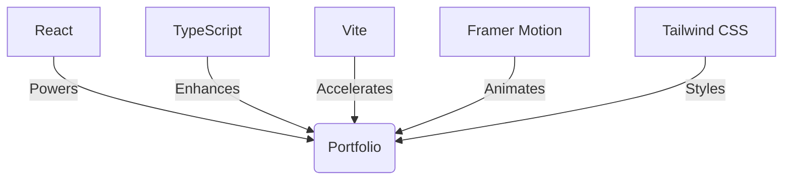

 ____   __   ____  ____  ____  __   __    __   __  
(  _ \ /  \ (  _ \(_  _)(  __)/  \ (  )  /  \ (  ) 
 ) __/(  O ) )   /  )(   ) _)(  O )/ (_/( () )/ (_/
(__)   \__/ (__\_) (__) (__)  \__/ \____/\__/ \____/
```

# 🎨 My Digital Canvas: A React & TypeScript Masterpiece

Welcome, digital explorer! 👋 You've just stumbled upon the source code of my virtual kingdom. Prepare to embark on a journey through the pixelated landscapes of my creativity!

## 🌈 What's This Sorcery?

This isn't just a portfolio—it's a living, breathing digital ecosystem crafted with React and TypeScript, and turbocharged by Vite. It's where my ideas come to party and my projects come to shine!

## 🎭 Features That'll Knock Your Socks Off

```
🌓 Theme Toggler | 🚀 Smooth Scrolling | 💼 Project Showcase
📄 Downloadable Resume | 🎭 Animated Transitions | 🎨 Custom Illustrations
```

- **🌓 Theme Toggler**: Light side or dark side? Why not both? Switch themes faster than a chameleon in a disco!
- **🚀 Smooth Scrolling**: Glide through sections smoother than a penguin on an ice slide.
- **💼 Project Showcase**: Where my digital offspring flex their JavaScript muscles.
- **📄 Downloadable Resume**: My professional saga, downloadable faster than you can say "Hired!"
- **🎭 Animated Transitions**: Because in 2023, if it ain't moving, is it even alive?
- **🎨 Custom Illustrations**: Hand-crafted pixel art that'll make your retinas dance with joy!

## 🛠️ The Magical Ingredients



- **React**: The wizard behind the curtain
- **TypeScript**: Keeping our types strong and our bugs weak
- **Vite**: Because life's too short for slow builds
- **Framer Motion**: Adding some pizzazz to our pixels
- **Tailwind CSS**: Making our styles look fly without even trying

## 🚦 Embark on Your Own Adventure

1. Clone this realm: `git clone https://github.com/yourusername/portfolio.git`
2. Summon the node modules: `npm install`
3. Ignite the development server: `npm run dev`
4. Open a portal at `http://localhost:3000` (or follow the white rabbit to whatever port Vite chooses)

## 📂 The Lay of the Land

```
/
├── 🌳 public/
│   └── 📁 assets/
│       └── 📄 resume.pdf
├── 🌺 src/
│   ├── 🏠 components/
│   │   └── Main.tsx
│   ├── 📚 pages/
│   │   └── index.tsx
│   └── 🎨 styles/
│       └── globals.css
└── 📜 README.md (You are here, adventurer!)
```

## 🌟 Join the Creative Cosmos!

Found a glitch in the matrix? Got an idea that's out of this world? Or just want to chat about the latest JavaScript framework? Open an issue or, even better, a pull request! Let's turn this portfolio into a digital masterpiece together!

## 🎉 Let's Connect Across the Multiverse!

- 🐦 Twitter: [@yourhandle](https://twitter.com/yourhandle)
- 💼 LinkedIn: [Your Name](https://linkedin.com/in/yourprofile)
- 🌐 Website: [yourwebsite.com](https://yourwebsite.com)

Remember, in the grand tapestry of the internet, every pixel counts. Let's make them beautiful together! Happy coding, and may your functions always return true! 🚀✨

```
   __________________
  /\  ______________ \
 /::\ \ZZZZZZZZZZZZ/\ \
/:/\.\ \        /:/\:\ \
/:/Z/\:\ \      /:/Z/\:\ \
/:/Z/__\:\ \____/:/Z/  \:\ \
/:/Z/____\:\ \___\/Z/    \:\ \
\:\ \ZZZZZ\:\ \ZZ/:/    _/:/
 \:\ \     \:\ \ /:/  _/:/
  \:\ \     \:\ /:/  /:/
   \:\ \     \:\/:/  /:/
    \:\ \     \::/__/:/
     \:\ \     \:\  /:/
      \:\ \     \:\/:/
       \:\ \     \::/
        \:\ \     \/
         \:\ \
          \:\ \
           \:\ \
            \:\ \
             \:\ \
              \:\ \
               \:\ \
                \:\ \
                 \:\ \
                  \:\ \
                   \:\ \
                    \:\ \
                     \:\ \
                      \:\ \
                       \:\ \
                        \:\ \
                         \:\ \
                          \:\ \
                           \:\ \
                            \:\ \
                             \:\ \
                              \:\ \
                               \:\ \
                                \:\ \
                                 \:\ \
                                  \:\ \
                                   \:\ \
                                    \:\ \
                                     \:\ \
                                      \:\ \
                                       \:\ \
                                        \:\ \
                                         \:\ \
                                          \:\ \
                                           \:\ \
                                            \:\ \
                                             \:\ \
                                              \:\ \
                                               \:\ \
                                                \:\ \
                                                 \:\ \
                                                  \:\ \
                                                   \:\ \
                                                    \:\ \
                                                     \:\ \
                                                      \:\ \
                                                       \:\ \
                                                        \:\ \
                                                         \:\ \
                                                          \:\ \
                                                           \:\ \
                                                            \:\ \
                                                             \:\ \
                                                              \:\ \
                                                               \:\ \
                                                                \:\ \
                                                                 \:\ \
                                                                  \:\ \
                                                                   \:\ \
                                                                    \:\ \
                                                                     \:\ \
                                                                      \:\ \
                                                                       \:\ \
                                                                        \:\ \
                                                                         \:\ \
                                                                          \:\ \
                                                                           \:\ \
                                                                            \:\ \
                                                                             \:\ \
                                                                              \:\ \
                                                                               \:\ \
                                                                                \:\ \
                                                                                 \:\ \
                                                                                  \:\ \
                                                                                   \:\ \
                                                                                    \:\ \
                                                                                     \:\ \
                                                                                      \:\ \
                                                                                       \:\ \
                                                                                        \:\ \
                                                                                         \:\ \
                                                                                          \:\ \
                                                                                           \:\ \
                                                                                            \:\ \
                                                                                             \:\ \
                                                                                              \:\ \
                                                                                               \:\ \
                                                                                                \:\ \
                                                                                                 \:\ \
                                                                                                  \:\ \
                                                                                                   \:\ \
                                                                                                    \:\ \
                                                                                                     \:\ \
                                                                                                      \:\ \
                                                                                                       \:\ \
                                                                                                        \:\ \
                                                                                                         \:\ \
                                                                                                          \:\ \
                                                                                                           \:\ \
                                                                                                            \:\ \
                                                                                                             \:\ \
                                                                                                              \:\ \
                                                                                                               \:\ \
                                                                                                                \:\ \
                                                                                                                 \:\ \
                                                                                                                  \:\ \
                                                                                                                   \:\ \
                                                                                                                    \:\ \
                                                                                                                     \:\ \
                                                                                                                      \:\ \
                                                                                                                       \:\ \
                                                                                                                        \:\ \
                                                                                                                         \:\ \
                                                                                                                          \:\ \
                                                                                                                           \:\ \
                                                                                                                            \:\ \
                                                                                                                             \:\ \
                                                                                                                              \Z/
